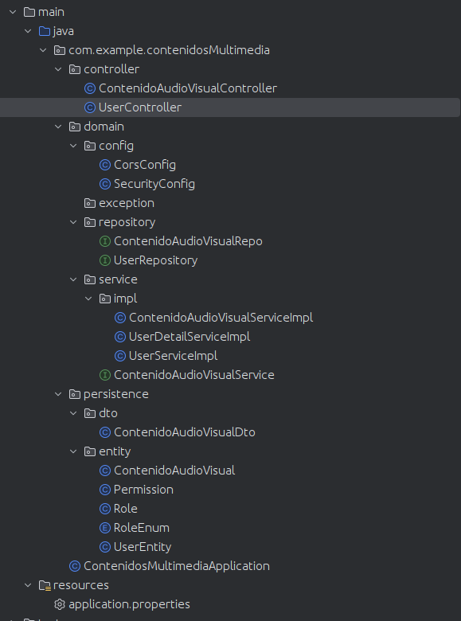
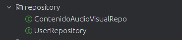
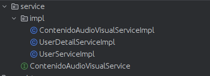
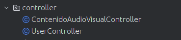
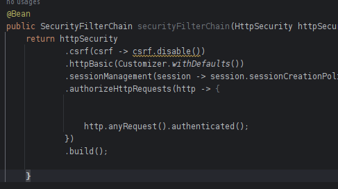
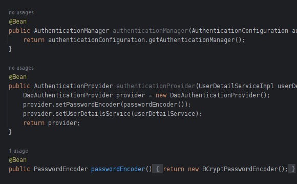

# Aplicacion de contenidos de el usuario

Con esta aplicacion puede consultar la informacion de los contenidos audiovisuales que estan registrados por cada usuario.


A continuacion se describe el proyecto


## Caracterisitcas
 
- Cada usuario tiene su lista de permisos, en una relacion muchos a muchos
- Cada usuario tiene su lista contenidos audio visuales en una relacion muchos a muchos.


## Requisitos Previos

- JDK (Java Development Kit) instalado en tu sistema.
- IntelliJ or algun otro IDE especializado en java.
- Maven instalado en tu IDE.


## Tecnologias usadas en el proyecto
 
- Java
- Spring Boot 
  + JPA
  + JPQL
  +  Spring Security
  +  JWT
- MySQL
- Swagger


## Construccion de el proyecto


### strucutura de carpetas

La estructura de carpetas es una tipica de proyectos spring boot, con su apartado de domain, persistence y controller

<div align="center">
  <h3>Estrucutura de carpetas</h3>
  
</div>


### Back-End  construction

#### Spring Boot entities

**Entities**

Se uso spring jpa para mapear las entidades en columnas de la tabla en la base de datos.

Se tienen las entidades de usuario, los contenidos audiovisuales , los roles y permisos de el usuario

<div align="center">
  <h3>Entidades</h3>
  
</div>


**Repositories**


Se crearon los repositorios para nuestras entidades de usuario y contenido

Para las demas entidades no se crearon porque solo sirven para complementar el contenido de usuario , usuario es el importante y el que se crea y elimina en la base de datos

<div align="center">
  <h3>Repositorio</h3>
  
</div>


**Services**

Se crearon los servicios para las entidades 

<div align="center">
  <h3>Servicios</h3>
  
</div>


**Controllers**

Se crearon los controladores 


<div align="center">
  <h3>Controladores</h3>
  
</div>


#### DataBase

Se uso el gestor de base de datos MySql, como se ve en el archivo de configuracion application properties, con el cual configuramos el controlador mySQl

<div align="center">
  <h3>Configuracion</h3>
  
</div>


#### Autenticacion


Se uso spring security para manejar a los usuarios y sus permisos, veamos los archivos que afectan a este comportamiento


Se configuro cors para que se puedan hacer todas los tipos de consultas desde el local host

<div align="cors">
   <h3>Cors</h3>
  
</div>


En el archivo principal de configuracon de spring *Security config*, se opto por hacer que en todas las consultas el usuario este autenticado.Anyrequest, authenticated, todas las consutas autenticadas

<div align="center">
   <h3>Peticiones</h3>
  
</div>


There is the AuthController class to handle user authorization and authentication.


<div align="center">
   <h3>AuthController</h3>
  
</div>


#### Front-End construction

To access the information returned by the API, a page was created with html and css.

It was decided to use web page templates, taken from the *AdminLTE* framework, so the css of the html files is handled by the *Bootstrap* framework.

We have the pages for the user to log in, register, and the dashboard page with all the available queries.

- Home
- Log-In
- Register


<div align="center">
  <h3>Pages File</h3>
  
</div>


**Functionality**

The functionality and interactivity is handled by javascript.
The front-end functionality is organized in different javascript files.

In the API folder, we have defined the *config* file and the *queries* file.

<div align="center">
  <h3>Api Folder</h3>
  
</div>


With config we define the uri to do the queries

<div align="center">
  <h3>Config File</h3>
  
</div>


With queries  a special function is defined , which allows you to make all queries and fetch your information.


<div align="center">
  <h3>queries file</h3>
  
</div>


In the js folder, javascript files are defined for each html page. 

<div align="center">
  <h3>Js Folder</h3>
  
</div>


<div align="center">
  <h3>Log In js</h3>
  
</div>

The javascript app file is used to detect which page the user is on, and depending on this, it loads the corresponding javascript file.

<div align="center">
  <h3>App file</h3>
  
</div>


In the components folder, the html components  are defined with javascript, so that they can be used as html tags in other html files.

<div align="center">
  <h3>Components Folder</h3>
  
</div>


<div align="center">
  <h3>Component Example</h3>
  
</div>


In the util folder there are the files *Auth*, *Constants*, *Route*.

<div align="center">
  <h3>Util Folder</h3>
  
</div>

The Auth file handles everything related to authentication from the front end, defining that the user must register before logging in, verifying the user and token when user logs in, etc..

<div align="center">
  <h3>Auth File</h3>
  
</div>

In constants the uri from which the front-end works is defined

<div align="center">
  <h3>Constants File</h3>
  
</div>


In Routes file, the queries are saved in an object, so that they can be easily used from the file that displays the dashboard.

<div align="center">
  <h3>Routes File</h3>
  
</div>


## Installation and Execution

1. Clone this repository to your local machine.

```bash
git clone https://github.com/Dabrox02/GrowMart.git
```
2. Access the 'main' branch

```bash
git switch main
```

3. Configure the Application properties according to your mySQL or database management system username and password. Application properties is a general settings file for spring boot

<div align="center">
  <h3>Application properties Mysql</h3>
  
</div>

- *spring.datasource.url=jdbc:mysql://localhost:3306/jardineria* you change *jardineria* to the name of the database you defined
- *spring.datasource.username* you change the password 
- *spring.datasource.password* you change the user 

If you are using another database management system, you must find the corresponding dependency and add it to the pom file, and change the application properties settings to match your new database management system.

<div align="center">
  <h3>Mysql dependency</h3>
  
</div>


4. You can use the api documentation that is provided by swagger. With this documentation you can test the queries if you want to 


<div align="center">
   <h3>Swagger settings in application properties</h3>
  
</div>


You just have to enter the following link in your web browser

```bash
http://localhost:8080/doc/swagger-ui/index.html
```

<div align="center">
  <h3>Swagger view</h3>
  
</div>


5. Start the application, execute 'Run Application'.

<div align="center">
  <h3>Run Application</h3> 
  
</div>

4. Access the application from your web browser using the URL:
```bash
http://localhost:5500
```


## Usage


### User Registration

When you first enter the application you will be shown the page to create a user.

<div align="center">
  <h3>Sign up/Registration</h3> 
  
</div>

You have to enter a new user and define a password.

### Log in 

Once you enter the application, you can log in with the username and password you defined earlier.

<div align="center">
  <h3>Log In</h3> 
  
</div>

### Error logging in 

If you enter your credentials incorrectly, you will get an error message when trying to log in.

<div align="center">
  <h3>Error logging In </h3> 
  
</div>

### DashBoard and queries 

When you enter the dashboard, you have several options in the left panel, which are the entities that you can consult

<div align="center">
  <h3>DashBoard and queries</h3> 
  
</div>

You must click,  first to select one of the entities and then click again to make your query.

<div align="center">
  <h3>Select query</h3>
  
</div>

If you do so, the information you requested will be displayed, if you wish to make another query, just click and the page will be updated with the new query.

<div align="center">
  <h3>Select another query</h3>
  
</div>

## Contribution

Contributions are welcome. If you wish to contribute to this project, please follow the steps:

1. Make a fork of the project on github, and clone the repository on your pc.

2. Create a new branch .

```bash
git checkout -b feature
```

3. Commit the changes you added

```bash
git commit -am 'Add new feature'
```

4. Push the branch you created

```bash
git push origin feature
```

5. Create a new Pull Request in your github fork repository.
