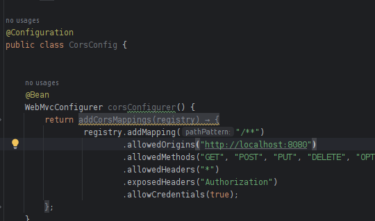

# Aplicacion de contenidos de el usuario

Con esta aplicacion puede consultar la informacion de los contenidos audiovisuales que estan registrados por cada usuario.

A continuacion se describe el proyecto

## Caracterisitcas
 
- Cada usuario tiene su lista de permisos, en una relacion muchos a muchos
- Cada usuario tiene su lista contenidos audio visuales en una relacion muchos a muchos.

## Requisitos Previos

- JDK (Java Development Kit) instalado en tu sistema.
- IntelliJ or algun otro IDE especializado en java.
- Maven instalado en tu IDE.

## Tecnologias usadas en el proyecto
 
- Java
- Spring Boot 
  + JPA
  + JPQL
  +  Spring Security
  +  JWT
- MySQL
- Swagger

## Construccion de el proyecto

### strucutura de carpetas

La estructura de carpetas es una tipica de proyectos spring boot, con su apartado de domain, persistence y controller

  <h3>Estrucutura de carpetas</h3>
  

### Back-End  construction

#### Spring Boot entities

**Entities**

Se uso spring jpa para mapear las entidades en columnas de la tabla en la base de datos.

Se tienen las entidades de usuario, los contenidos audiovisuales , los roles y permisos de el usuario

  <h3>Entidades</h3>
  

**Repositories**

Se crearon los repositorios para nuestras entidades de usuario y contenido

Para las demas entidades no se crearon porque solo sirven para complementar el contenido de usuario , usuario es el importante y el que se crea y elimina en la base de datos

  <h3>Repositorio</h3>
  

**Services**

Se crearon los servicios para las entidades 

  <h3>Servicios</h3>
  

**Controllers**

Se crearon los controladores 

  <h3>Controladores</h3>
  

#### DataBase

Se uso el gestor de base de datos MySql, como se ve en el archivo de configuracion application properties, con el cual configuramos el controlador mySQl

  <h3>Configuracion</h3>
  

#### Autenticacion

Se uso spring security para manejar a los usuarios y sus permisos, veamos los archivos que afectan a este comportamiento

Se configuro cors para que se puedan hacer todas los tipos de consultas desde el local host

   <h3>Cors</h3>
  

En el archivo principal de configuracon de spring *Security config*, se opto por hacer que en todas las consultas el usuario este autenticado.Anyrequest, authenticated, todas las consutas autenticadas

   <h3>Peticiones</h3>
  

